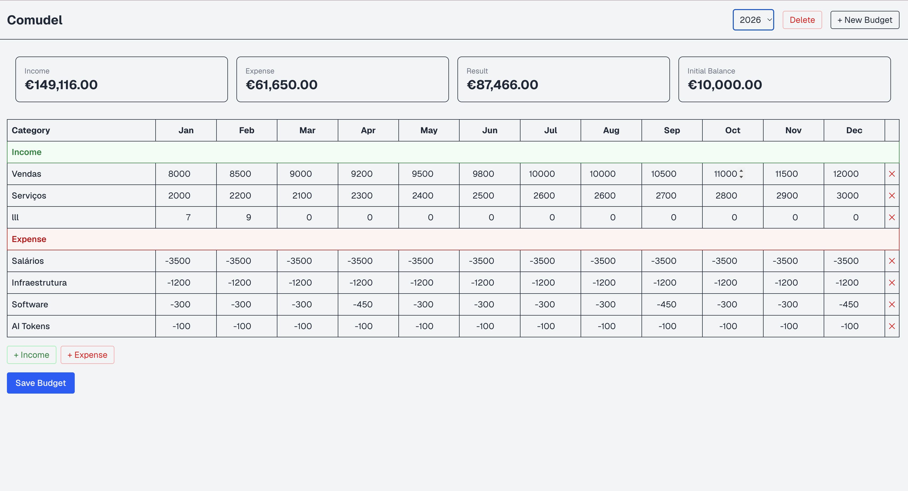
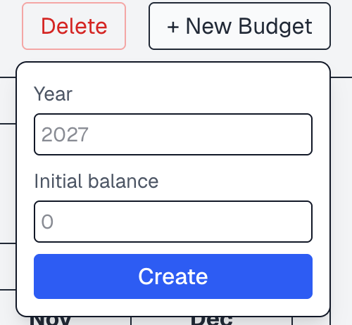
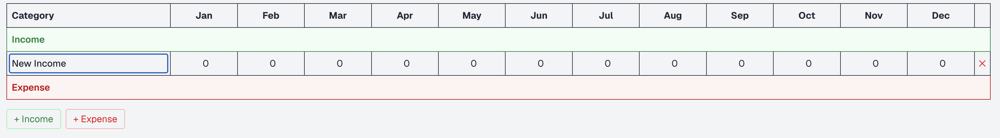

# Company Budget planner 

Prototype of an **annual budget planning** tool. It lets a company create budgets per year,
define income and expenses per month organized by category, see the computed totals, and persist
everything in PostgreSQL — with a Node.js/TypeScript API and a simple web interface.

---

## Requirements

- **Node.js** 20+ and **npm**
- **Docker** + **Docker Compose** (for the PostgreSQL database)

---

## Running the project

From the project root:

```bash
# 1. Install dependencies (Next, React, Prisma, Zod, etc.)
npm install

# 2. Create a .env file by copying .env.example
#    (credentials match the ones in docker-compose.yml)

# 3. Start PostgreSQL (the comudel-db container)
docker compose up -d

# 4. Generate the Prisma client
npx prisma generate

# 5. Apply the migrations (creates the tables)
npx prisma migrate deploy

# 6. (Optional) Seed the sample 2026 budget
npx prisma db seed

# 7. Start the app
npm run dev
```

---

## Architecture

A single **Next.js (App Router)** application, with frontend and backend in the same project.

### Stack

- **Next.js** + **React** + **TypeScript**
- **Backend** = Route Handlers in `src/app/api/**` (run on Node.js)
- **Prisma 7** (ORM) + **PostgreSQL 16** (via Docker Compose)
- **Zod 4** — input validation on the write endpoints
- **Tailwind 4** — UI

### Structure

```
src/
├── app/
│   ├── api/budgets/
│   │   ├── route.ts          # GET , POST 
│   │   └── [id]/route.ts     # GET , PUT , DELETE
│   ├── page.tsx              # the dashboard 
│   ├── layout.tsx            # root layout 
│   └── globals.css
├── components/               # presentational components (grid, cards, year selector…)
└── lib/
    ├── prisma.ts             # Prisma client (singleton)
    ├── calculations.ts       # totals (pure functions)
    ├── validation.ts         # Zod schemas (+ types via z.infer)
    ├── budgets.ts            # getBudgetWithTotals → BudgetDTO
    └── types.ts              # DTOs shared between API and UI
```

### API endpoints

**`src/app/api/budgets/route.ts`** — the budget collection
- **`GET /api/budgets`** — lists all budgets as a lightweight array of `{ id, year }`
- **`POST /api/budgets`** — creates a new, empty budget. 
  

**`src/app/api/budgets/[id]/route.ts`** — a single budget
- **`GET /api/budgets/[id]`** — returns the full budget 
- **`PUT /api/budgets/[id]`** — delete-and-recreate approach for budget changes
- **`DELETE /api/budgets/[id]`** — deletes the budget; 

### Data model

```
Budget (1) ──> Category (N) ──> MonthlyEntry (N)
```

- **Budget** — annual budget.
- **Category** — a grid row (e.g. Sales, Salaries). `type` = `INCOME | EXPENSE`.
- **MonthlyEntry** — a category's value for one month.

### Business logic

- An **annual budget** belongs to a single year — **one budget per year** (budget = year basically).
- Each budget has **categories**, each of type **Income** or **Expense**.
- Every category holds **12 monthly values** (January–December).
- **Amounts are stored as positive magnitudes** — whether a value adds or subtracts is
  decided by the category's **type**, not by the sign of the number. 
- The summary **totals are computed from the categories** (never stored):
  - **Income** = sum of all monthly amounts across the Income categories.
  - **Expense** = sum of all monthly amounts across the Expense categories.
  - **Result** = Income − Expense.
  - **Initial Balance** = the budget's starting balance, immutable (Design decisions).
    

### Design decisions

- **Shared DTOs** (`lib/types.ts`) — the backend returns `BudgetDTO` (typed in
  `getBudgetWithTotals`) and the frontend consumes the same type: a single end-to-end contract.
- **Validation at the boundary** — write-endpoint input is validated with **Zod**
  (`lib/validation.ts`); the types are derived from the schemas via `z.infer`.
- **PUT = delete-and-recreate** — `PUT` deletes the budget's, all changes to the budget comes down to this endpoint.

- **Single-company app** — `year` is unique (one budget per year); `companyName` is fixed. The
  initial balance is set on creation (`POST`) and is immutable afterwards.

### Known limitations / future improvements

- **Multi-company** — currently single-company. Extension: a `Company` model + `Budget.companyId`
  + `@@unique([companyId, year])`.
- **Error handling / UX** — uses `alert`/`confirm` (fine for a prototype); 
- **Fetch response typing** — `res.json()` returns `any` on the client; it could be typed
  (or validated) with the shared DTOs.
- **delete-and-recreate** — Not ideal for obvious reasons, but given the time constraint and availability,    was the choice made. 

---

## Screenshots & Usage Guide

<!-- Place the image files in the docs/ folder and commit them (git add docs/). -->
<!-- Adjust the image paths/filenames below to match your screenshots. -->

The dashboard shows the selected year's summary cards (Income, Expense, Result, Initial
Balance) and the editable Category × Jan–Dec grid, grouped into **Income** and **Expense**.



### Creating a budget

Click **+ New Budget**, enter the **year** and the **initial balance**, then **Create**.



### Selecting a year

Use the **year selector** in the header to switch between budgets. The summary cards and the
grid update to show the chosen year. 

### Editing categories and values

- **Add a category** with **+ Income** or **+ Expense** — it appears in the matching section.
- **Rename** a category by typing in its name field.
- **Edit a monthly value** by typing in the cell. Expenses are shown as negative for clarity.
- **Remove a category** with the **✕** button (asks for confirmation).

NOTE: All Changes to the grid, including deleting a  category will only be applied after clicking the "Save Budget" button.



### Saving

Edits are kept locally until you click **Save Budget**. 

### Deleting a budget

With a budget selected, click **Delete** in the header (asks for confirmation). It removes the
budget and its categories/months, and switches to another year (or to the empty state if none
remain).

